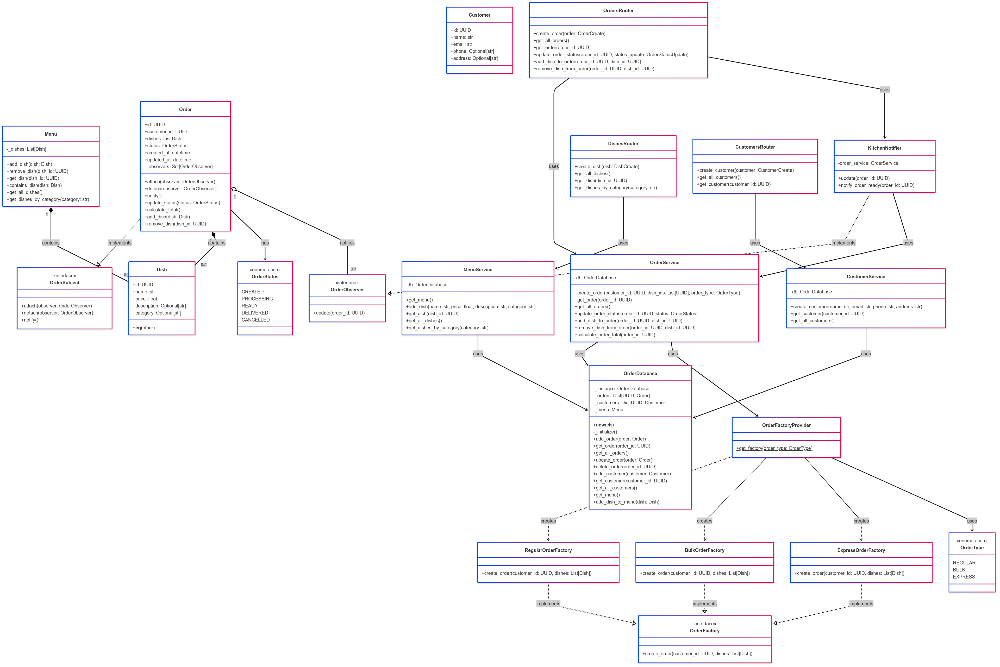

# Лабораторна робота 4. ПЗ з використанням шаблонів проектування

## TODO
- [ ] Додати UML-діаграми до документації
- [ ] Реалізувати класи згідно з принципами SOLID
- [ ] Написати базові модульні тести (мінімум 10)
- [ ] Реалізувати функціонал через TDD
- [ ] Застосувати шаблони проектування (Singleton, Factory, Observer)
- [ ] Написати тести для шаблонів проектування (мінімум 10)
- [ ] Підготувати короткий звіт із підсумком результатів тестів

---

## Інструкції

**Термін:** 16 травня 2025 р., 23:59

### Завдання:

#### Частина 1: Проектування системи відповідно до принципів SOLID
- Визначте класи ключових систем: "Меню", "Замовлення", "Клієнт", "Страва", `KitchenNotifier`.
- Розробіть діаграму класів UML, яка відображає принципи SOLID (SRP, OCP, DIP).
- Реалізуйте початкову версію класів (скелети, без логіки).
- Перевірте відповідність принципам SOLID.
- Напишіть базові тести (мінімум 10), які перевіряють створення об'єктів та базові взаємодії.

#### Частина 2: Розробка системи за допомогою TDD
- Почніть з написання модульних тестів для функціоналу (додавання страв, створення замовлення, асоціювання замовлення з клієнтом, оповіщення кухні).
- Реалізуйте функціональність, щоб тести проходили.
- Тестуйте різні сценарії (вдалі/невдалі додавання, порожнє меню, відсутній покупець тощо).
- Мінімум 10 модульних тестів.

#### Частина 3: Використання шаблонів проектування
- Застосуйте шаблони: Singleton (база даних замовлень), Factory (різні типи замовлень), Observer (сповіщення кухні).
- Напишіть тести для перевірки шаблонів (мінімум 10):
  - Singleton створює лише один екземпляр
  - Factory створює різні типи замовлень
  - Observer сповіщає кухню про нове замовлення

#### Вимоги:
- Впроваджувати класи та функціонал за принципами SOLID
- Використовувати TDD
- Застосовувати шаблони проектування
- Написати мінімум 10 модульних тестів для основних функцій, взаємодій і шаблонів
- Створити UML-діаграми структури системи та шаблонів
- Підготувати короткий звіт із підсумком результатів тестів (журнал тестів)